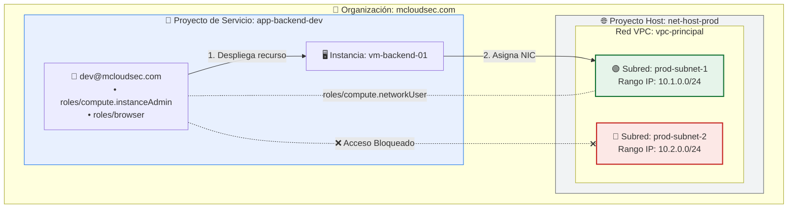

# 06 - GCP Shared VPC & Subnet-Level IAM Isolation

## 📌 Overview
This lab demonstrates the implementation of a **Shared VPC** architecture in Google Cloud Platform (GCP), applying the **Principle of Least Privilege (PoLP)** through IAM policies at the individual subnet level.

## 🏢 Organization Environment
* **Organization:** `mcloudsec.com`
* **Host Project:** `net-host-prod` (Contains the centralized network infrastructure)
* **Service Project:** `app-backend-dev` (Contains the compute/development resources)

---

## 📐 Network Architecture and Permissions

```text
                     ORGANIZATION (mcloudsec.com)
                                  │
         ┌────────────────────────┴────────────────────────┐
         ▼                                                 ▼
    HOST PROJECT                                    SERVICE PROJECT
  (net-host-prod)                                  (app-backend-dev)
         │                                                 │
  ├── vpc-principal                                        │
  │    ├── prod-subnet-1 (10.1.0.0/24) <───────────────────┼── [dev@mcloudsec.com]
  │    └── prod-subnet-2 (10.2.0.0/24) (Blocked)           │    (Roles: InstanceAdmin + Browser)
  │                                                        └── Instance: vm-backend-01
  └── IAM Subnet-level Binding:
       dev@mcloudsec.com -> roles/compute.networkUser (Only on prod-subnet-1)
```

🛠️ Step-by-Step Setup (Google Cloud Console)
1. Creation of the VPC Network and Subnets (Host Project)
In the net-host-prod project, the custom-mode VPC network vpc-principal was created.

Two subnets were created in the us-central1 region:

prod-subnet-1 (10.1.0.0/24)

prod-subnet-2 (10.2.0.0/24)

2. Shared VPC Configuration
Enabled net-host-prod as a Host Project in VPC network > Shared VPC.

Attached the app-backend-dev project as a Service Project.

Changed the permission assignment mode from Project-level to Individual subnet-level permissions.

3. Granular IAM Permission Delegation
At Subnet Level (prod-subnet-1): Granted the roles/compute.networkUser role to user dev@mcloudsec.com.

At Service Project Level (app-backend-dev): Granted the roles/compute.instanceAdmin and roles/browser roles to dev@mcloudsec.com.

🧪 Validation and Isolation Testing
Log in to the GCP Console with the dev@mcloudsec.com account.

Select the app-backend-dev project.

Navigate to Compute Engine > VM instances and click Create Instance.

Under networking options, select Shared with me > vpc-principal.

Results Obtained and Validation:
✅ Allowed Subnet: prod-subnet-1 appears available for selection.

🛑 Successful Isolation: prod-subnet-2 remains hidden/disabled for the user, guaranteeing total isolation.

💡 Key Takeaways for GCP Cloud Network Engineer Certification
Granular Roles: Granting roles/compute.networkUser at the subnet level prevents overexposure of the core network.

Console Visibility: Without the roles/browser role at the project level, users without global permissions cannot select the project from the GCP console dropdown.

Billing: Compute resources and egress network traffic are always billed to the Service Project where the VMs reside.
