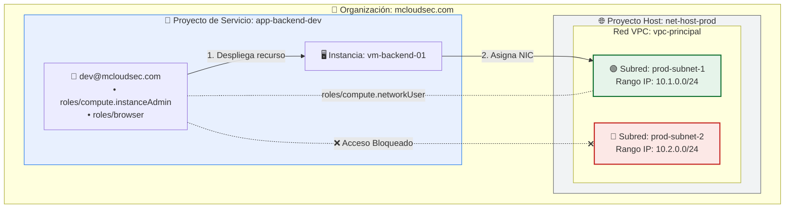

# 06 - GCP Shared VPC & Subnet-Level IAM Isolation

## 📌 Visión General
Este laboratorio demuestra la implementación de una arquitectura de **Shared VPC (VPC compartida)** en Google Cloud Platform (GCP) aplicando el **Principio de Menor Privilegio (PoLP)** mediante políticas de IAM a nivel de subred individual.

## 🏢 Entorno de la Organización
* **Organización:** `mcloudsec.com`
* **Proyecto Host:** `net-host-prod` (Contiene la infraestructura de red centralizada)
* **Proyecto de Servicio:** `app-backend-dev` (Contiene los recursos de cómputo/desarrollo)

---

## 📐 Arquitectura de Red y Permisos

```text
                     ORGANIZACIÓN (mcloudsec.com)
                                  │
         ┌────────────────────────┴────────────────────────┐
         ▼                                                 ▼
   PROYECTO HOST                                  PROYECTO DE SERVICIO
  (net-host-prod)                                (app-backend-dev)
         │                                                 │
  ├── vpc-principal                                        │
  │    ├── prod-subnet-1 (10.1.0.0/24) <───────────────────┼── [dev@mcloudsec.com]
  │    └── prod-subnet-2 (10.2.0.0/24) (Bloqueado)         │    (Roles: InstanceAdmin + Browser)
  │                                                        └── Instancia: vm-backend-01
  └── IAM Subnet-level Binding:
       dev@mcloudsec.com -> roles/compute.networkUser (Solo en prod-subnet-1)
```



🛠️ Configuración Paso a Paso (Google Cloud Console)
1. Creación de la Red VPC y Subredes (Proyecto Host)
En el proyecto net-host-prod, se creó la red VPC de modo personalizado vpc-principal.

Se crearon dos subredes en la región us-central1:

prod-subnet-1 (10.1.0.0/24)

prod-subnet-2 (10.2.0.0/24)

2. Configuración de Shared VPC
Se habilitó net-host-prod como Proyecto Host en Red de VPC > VPC compartida.

Se adjuntó el proyecto app-backend-dev como Proyecto de Servicio.

Se modificó el modo de asignación de permisos de A nivel de proyecto a Permisos individuales por subred.

3. Delegación Granular de Permisos IAM
A nivel de Subred (prod-subnet-1): Se otorgó el rol roles/compute.networkUser al usuario dev@mcloudsec.com.

A nivel de Proyecto de Servicio (app-backend-dev): Se otorgaron los roles roles/compute.instanceAdmin y roles/browser a dev@mcloudsec.com.

🧪 Validación y Pruebas de Aislamiento
Iniciar sesión en la consola con la cuenta dev@mcloudsec.com.

Seleccionar el proyecto app-backend-dev.

Navegar a Compute Engine > Instancias de VM y hacer clic en Crear Instancia.

En las opciones de red, seleccionar Redes compartidas conmigo > vpc-principal.

Resultados Obtención y Validación:
✅ Subred Permitida: prod-subnet-1 aparece disponible para ser seleccionada.

🛑 Aislamiento Exitoso: prod-subnet-2 permanece oculta/deshabilitada para el usuario, garantizando aislamiento total.

💡 Lecciones Clave para la Certificación GCP Cloud Network Engineer
Roles Granulares: Otorgar roles/compute.networkUser a nivel de subred previene la sobreexposición de la red central.

Visibilidad en Consola: Sin el rol roles/browser a nivel de proyecto, los usuarios sin permisos globales no pueden seleccionar el proyecto en el menú desplegable de la consola de GCP.

Facturación: Los recursos de cómputo y el tráfico de salida (egress) siempre se facturan al Proyecto de Servicio donde residen las VMs.


