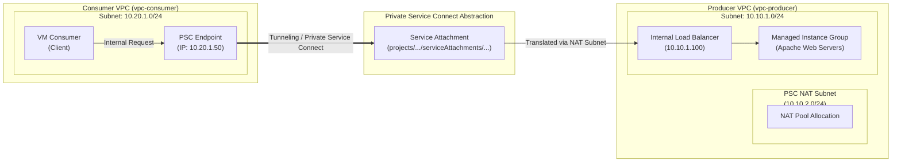

# Lab 07: GCP Private Service Connect (PSC) Modular Architecture

This repository contains the Terraform configuration for deploying a **Private Service Connect (PSC)** architecture on Google Cloud Platform using a modular approach. 

Private Service Connect allows private, secure, and unidirectional communication between two independent Google Cloud Virtual Private Clouds (VPCs)—Producer and Consumer—without requiring VPC Peering, Cloud VPN, or routing table exposure.

---

## 🏗️ Architecture & Network Topology

The solution is divided into two main domains:
1. **Producer VPC (`vpc-producer`)**: Hosts the backend application running behind an Internal Passthrough Network Load Balancer (ILB) and exposes a **Service Attachment**.
2. **Consumer VPC (`vpc-consumer`)**: Hosts a client Virtual Machine (`vm-consumer`) that accesses the producer service using a private endpoint (Forwarding Rule) targeting the Service Attachment.



---

## 📁 Repository Structure

```text
07-gcp-psc-lab/
├── main.tf              # Root module invoking Producer and Consumer modules
├── variables.tf         # Global input variables
├── outputs.tf           # Output values (Endpoint IP, Test commands)
├── terraform.tfvars     # Variable definitions (Project ID, Region, Zone)
└── modules/
    ├── producer/        # Producer VPC, Subnets, PSC NAT Subnet, MIG & ILB
    └── consumer/        # Consumer VPC, Subnet, VM & PSC Endpoint Forwarding Rule
```

---

## 🚀 Deployment Instructions

### Prerequisites
- Google Cloud SDK (`gcloud`) installed and configured.
- Terraform >= 1.3.0 installed.
- GCP Project with Compute Engine API enabled.

### 1. Clone & Navigate
```bash
git clone https://github.com/fertriana21-cell/gcp-terraform-labs.git
cd gcp-terraform-labs/07-gcp-psc-lab
```

### 2. Configure Variables
Create or edit `terraform.tfvars`:
```hcl
project_id = "YOUR_PROJECT_ID"
region     = "us-central1"
zone       = "us-central1-a"
```

### 3. Initialize & Deploy
```bash
terraform init
terraform plan
terraform apply --auto-approve
```

---

## 🧪 Validation & Testing

1. SSH into the Consumer VM using `gcloud`:
   ```bash
   gcloud compute ssh vm-consumer --zone=us-central1-a --project=YOUR_PROJECT_ID
   ```

2. Perform a `curl` request to the PSC Endpoint IP (`10.20.1.50`):
   ```bash
   curl http://10.20.1.50
   ```

3. Expected Output:
   ```html
   <h1>Hola desde el Servicio Productor de PSC 🚀</h1>
   ```

---

## 🧹 Cleanup

To destroy all created GCP resources and avoid ongoing costs:
```bash
terraform destroy --auto-approve
```