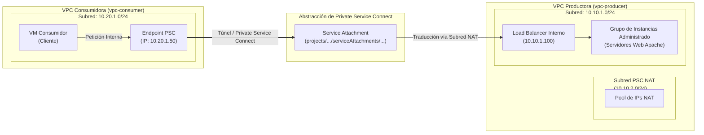

# Laboratorio 07: Arquitectura Modular con GCP Private Service Connect (PSC)

Este repositorio contiene la configuración de Terraform para desplegar una arquitectura de **Private Service Connect (PSC)** en Google Cloud Platform utilizando un enfoque totalmente modular.

Private Service Connect permite la comunicación privada, segura y unidireccional entre dos Redes Virtuales (VPC) independientes (Productora y Consumidora) sin necesidad de establecer VPC Peering, Cloud VPN ni compartir tablas de enrutamiento.

---

## 🏗️ Arquitectura y Topología de Red

La solución se divide en dos dominios independientes:
1. **VPC Productora (`vpc-producer`)**: Alberga la aplicación de backend ejecutándose detrás de un Load Balancer de Red Interno (ILB) y expone un **Service Attachment**.
2. **VPC Consumidora (`vpc-consumer`)**: Alberga una Máquina Virtual cliente (`vm-consumer`) que accede al servicio del productor mediante un Endpoint privado (Forwarding Rule) dirigido al Service Attachment.



---

## 📁 Estructura del Repositorio

```text
07-gcp-psc-lab/
├── main.tf              # Módulo raíz que invoca los módulos Productor y Consumidor
├── variables.tf         # Variables globales de entrada
├── outputs.tf           # Valores de salida (IP del Endpoint, comandos de prueba)
├── terraform.tfvars     # Definición de variables (Project ID, Región, Zona)
└── modules/
    ├── producer/        # VPC Productora, Subredes, Subred PSC NAT, MIG e ILB
    └── consumer/        # VPC Consumidora, Subred, VM y Forwarding Rule del Endpoint PSC
```

---

## 🚀 Instrucciones de Despliegue

### Requisitos Previos
- Google Cloud SDK (`gcloud`) instalado y configurado.
- Terraform >= 1.3.0 instalado.
- Proyecto GCP con la API de Compute Engine habilitada.

### 1. Clonar y Navegar
```bash
git clone https://github.com/fertriana21-cell/gcp-terraform-labs.git
cd gcp-terraform-labs/07-gcp-psc-lab
```

### 2. Configurar Variables
Crea o edita el archivo `terraform.tfvars`:
```hcl
project_id = "TU_PROJECT_ID"
region     = "us-central1"
zone       = "us-central1-a"
```

### 3. Inicializar y Aplicar
```bash
terraform init
terraform plan
terraform apply --auto-approve
```

---

## 🧪 Validación y Pruebas

1. Conéctate vía SSH a la VM Consumidora usando `gcloud`:
   ```bash
   gcloud compute ssh vm-consumer --zone=us-central1-a --project=TU_PROJECT_ID
   ```

2. Realiza una petición `curl` hacia la IP del Endpoint PSC (`10.20.1.50`):
   ```bash
   curl http://10.20.1.50
   ```

3. Resultado esperado:
   ```html
   <h1>Hola desde el Servicio Productor de PSC 🚀</h1>
   ```

---

## 🧹 Limpieza

Para eliminar todos los recursos creados en GCP y evitar cargos continuos:
```bash
terraform destroy --auto-approve
```